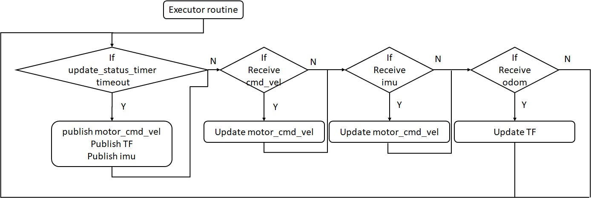

# NeuronBot2 Base_driver Design

## Concept

## Implementation

## Launch file
Launch NeuronBot2 with the following command.

    ros2 launch neuronbot2_bringup neuronbot2_bringup.launch.py

Along with the base_driver, the launch file will also run rplidar, ekf, joint_state_publisher, and robot_state_publisher.

- **robot_state_publisher**

    Publish TF according to the URDF file.

- **rplidar**

    Bring up RPlidar.

- **joint_state_publisher**

    Publish robot's revolute frame (wheels)

- **neuronbot2_bringup**

    Bring up NeuronBot2 motor controller.

- **robot_localization**

    EKF