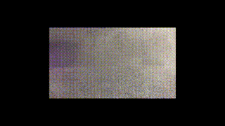
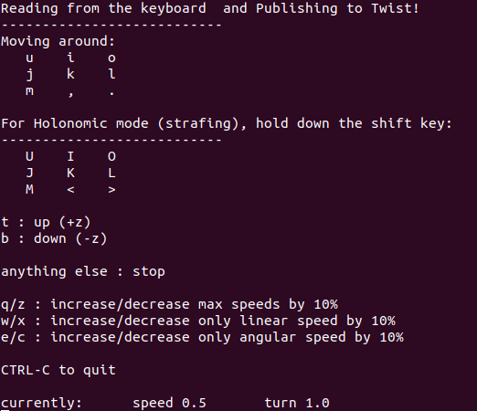
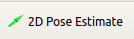
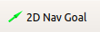

# Bring up your NeuronBot2


Now, it's time to launch your NeuronBot2 and do a Robotic-Hello-World thing -- telop it.
### Launch NeuronBot2
Open a new terminal (Ctrl + Alt + t).
   ```
   source /opt/ros/dashing/setup.bash
   source ~/neuronbot2_ros2_ws/install/local_setup.bash
   ros2 launch neuronbot2_bringup neuronbot2_bringup.launch.py
   ```
###  Teleop NeuronBot2
   ```
   source /opt/ros/dashing/setup.bash
   ros2 run teleop_twist_keyboard teleop_twist_keyboard
   ```
   Follow the hints and start to cruise your NeuronBot2.

   
### SLAM your map
1. Launch SLAM as well as Rviz.
   
   ***We provide three slam methods.***

   * Gmapping
   ```
   ros2 launch  neuronbot2_slam gmapping.launch.py open_rviz:=true
   ```
   * Slam_toolbox
   ``` 
   ros2 launch  neuronbot2_slam slam_toolbox.launch.py open_rviz:=true
   ```
   * Cartographer
   ```
   ros2 launch  neuronbot2_slam cartographer.launch.py open_rviz:=true
   ```
2. Teleop NeuronBot2 to explore the world
   ```
   # Run on the other terminal
   source /opt/ros/dashing/setup.bash
   ros2 run teleop_twist_keyboard teleop_twist_keyboard
   ```
3. Save the map
   ```
   source /opt/ros/dashing/setup.bash 
   ros2 run nav2_map_server map_saver -f <map_dir>/<map_name>
   ```

   The map is ready and SLAM can be turned off.
### Navigation

   * Try navigation on your own map. 
      ```
      ros2 launch neuronbot2_nav neuronbot2_nav.launch.py map_dir:=<full_path_to_your_map_name.yaml> open_rviz:=true
      ```
1. Set Estimation
   
      

   Click "2D Pose Estimate", and set estimation to the approximate location of robot on the map.

2. Set Goal
 
   

   Click "2D Nav Goal", and set goal to any free space on the map.
   
