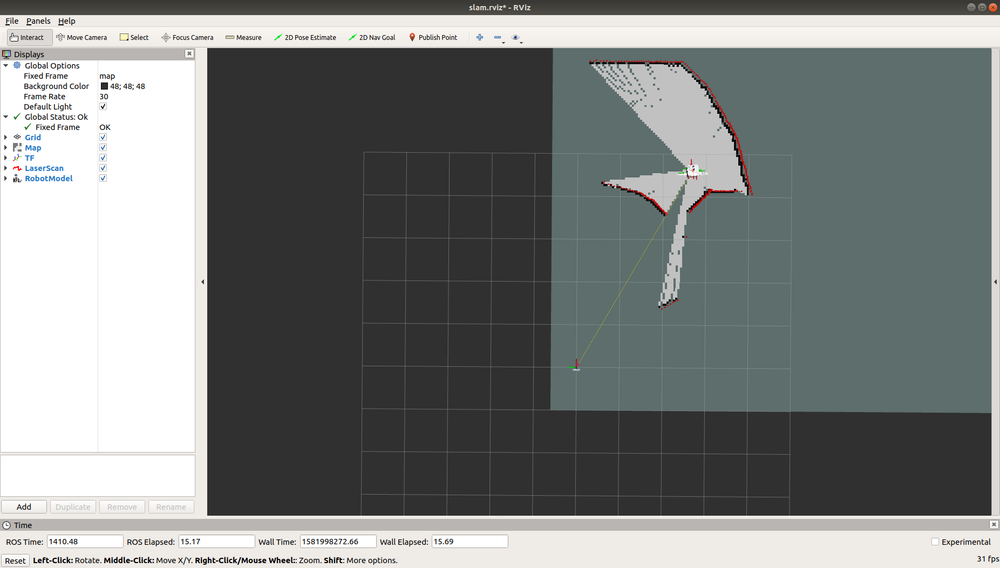

# Bring up NeuronBot2 in Simulation

### Summon the NeuronBot2 into Gazebo
1. Specify the model path for Gazebo
   ```
   source /opt/ros/dashing/setup.bash
   source ~/neuronbot2_ros2_ws/install/local_setup.bash
   ```
2. Launch Gazebo simulation.
    
   ***There are two worlds for users to explore.***
   * Mememan world
   ```
   ros2 launch neuronbot2_gazebo neuronbot2_world.launch.py world_model:=mememan_world.model
   ```
   
   * Phenix world
   ``` 
   ros2 launch neuronbot2_gazebo neuronbot2_world.launch.py world_model:=phenix_world.model
   ```
   
3. Teleop it in the world

    Users are able to control the NeuronBot2 with the following rosnode. Run it with the other terminal.
   ```
   source /opt/ros/dashing/local_setup.bash
   ros2 run teleop_twist_keyboard teleop_twist_keyboard
   ```
   

   ***p.s. To alleviate CPU consumption, close GAZEBO GUI by clicking x. This will not end the simulation server, which is running backend***
### SLAM the world
1. Launch SLAM as well as Rviz while the Gazebo simulation is running.
   
   ***We provide three slam methods.***

   * Gmapping
   ```
   ros2 launch  neuronbot2_slam gmapping.launch.py open_rviz:=true
   ```
   * Slam_toolbox
   ``` 
   ros2 launch  neuronbot2_slam slam_toolbox.launch.py open_rviz:=true
   ```
   * Cartographer
   ```
   ros2 launch  neuronbot2_slam cartographer.launch.py open_rviz:=true
   ```
    
2. Teleop NeuronBot2 to explore the world
   ```
   # Run on the other terminal
   source /opt/ros/dashing/setup.bash
   ros2 run teleop_twist_keyboard teleop_twist_keyboard
   ```
   
3. Save the map
   ```
   source /opt/ros/dashing/setup.bash 
   ros2 run nav2_map_server map_saver -f <map_dir>/<map_name>
   ```


   Then, you shall turn off SLAM.
### Navigate to the desired location
Once users obtain the map, the pgm file & yaml file, navigation is good to go.
   * Try navigation on your own map. 
      ```
      ros2 launch neuronbot2_nav neuronbot2_nav.launch.py map_dir:=<full_path_to_your_map_name.yaml> open_rviz:=true
      ```
1. Launch Navigation as well as Rviz while the Gazebo simulation is running. Default map is set to mememan.yaml.

   * Navigate in mememan map
   ```
   ros2 launch  neuronbot2_nav neuronbot2_nav.launch.py map_dir:=/home/<user_name>/neuronbot2_ros2_ws/src/neuronbot2/neuronbot2_nav/map/mememan.yaml open_rviz:=true

   ```
   * Navigate in phenix map
   ```
   ros2 launch  neuronbot2_nav neuronbot2_nav.launch.py map_dir:=/home/<user_name>/neuronbot2_ros2_ws/src/neuronbot2/neuronbot2_nav/map/phenix.yaml open_rviz:=true
   ``` 

   * Try navigation on your own map. ***Put the <map_name>.yaml and <map_name>.pgm into " ~/neuronbot2_ros2_ws/src/neuronbot2/neuronbot2_nav/map/ "***

    ```
   ros2 launch neuronbot2_nav neuronbot2_nav.launch.py map_name:=<map_name>.yaml open_rviz:=true
    ```
    
1. Set Estimation
   
   Click "2D Pose Estimate", and set estimation to the approximate location of robot on the map.

   
2. Set Goal

   Click "2D Nav Goal", and set goal to any free space on the map.
   
   

### Control with Behavior Tree
To run this demo, users should execute Gazebo server and Navigation (with Rviz for visualization) first.

1. Open the other terminal and source the environment variables.
   ```
   source /opt/ros/dashing/setup.bash
   source ~/neuronbot2_ros2_ws/install/local_setup.bash
   ```
2. Run Behavior Tree
   ```
   ros2 launch neuronbot2_bt neuronbot2_bt.launch.py bt_xml:=neuronbt.xml
   ```
   
