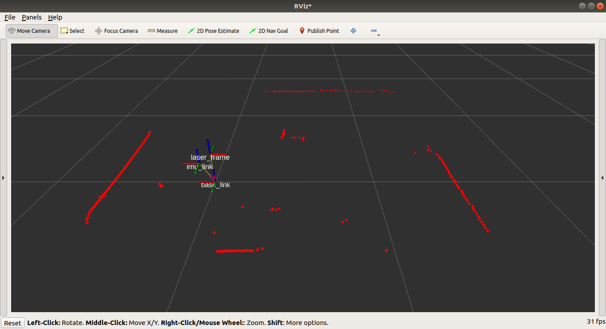

# NeuronBot2 Setup
Here are some tips that show users how to go through the basic setup of NeuronBot2 after receiving your beloved new bot.

TODO: 
1. ubuntu installation (pre-install, oder?)
2. Iinstall ROS2(pre-install ,or? )


## WIFI Setting

TODO

## Remote Connection
Wifi is the key to get rid of all the annoying cables. Under the same WIFI environment, your PC is able to directly SSH into the terminal of your NeuronBot2. Here are steps how to control the NeuronBot2 remotely with your PC.

1. Connect NeuronBot2 and PC into the same wifi env.
   
2. Note down IP of both PC and NeuronBot2.
   

3. **Ping** your NeuronBot2 with PC to check if they can receive packages from each others.
   
    **[on PC]**
    ```bash
    ping <IP_of_NeuronBot2>
    # e.g. ping 192.168.1.229 
    ```
    **Success** if the result shows these. Continue the next step.
    ```bash
    PING 192.168.1.229 (192.168.1.229) 56(84) bytes of data.
    64 bytes from 192.168.1.229: icmp_seq=1 ttl=64 time=7.85 ms
    64 bytes from 192.168.1.229: icmp_seq=2 ttl=64 time=8.96 ms
    64 bytes from 192.168.1.229: icmp_seq=3 ttl=64 time=6.81 ms
    ```

    **Fail** if the result does not show up. Users should check again the wifi connection on both machines.
    ```bash
    PING 192.168.1.229 (192.168.1.229) 56(84) bytes of data.
    
    --- 192.168.1.229 ping statistics ---
    37 packets transmitted, 0 received, 100% packet loss, time 36846ms
    ```

4. **SSH** into NeuronBot2.
   
    **[on PC]**
    
    SSH into NeuronBot2 with the name 'ros' and its IP.
    ```bash
    ssh ros@<IP_of_NeuronBot2>
    # e.g. ssh ros@192.168.1.229
    ```
    The password to log in is 'adlinkros'. It is normal not seeing the password while typing in.
    ```bash
    ros@192.168.1.229's password: 
    # type in 'adlinkros'.  
    ```
5. After log in, Choose the environment.
    ```bash
    Welcome to Ubuntu 18.04.4 LTS (GNU/Linux 4.15.0-20-generic x86_64)

    * Documentation:  https://help.ubuntu.co
    * Management:     https://landscape.canonical.co
    * Support:        https://ubuntu.com/advantag
  
    * Canonical Livepatch is available for installation  
      - Reduce system reboots and improve kernel security. Activate at:    
      https://ubuntu.com/livepatc
      
    177 packages can be updated.
    11 updates are security updates.
   
    Failed to connect to https://changelogs.ubuntu.com/meta-release-lts. Check your Internet connection or proxy settings. 
    
    Last login: Thu Feb 27 16:41:27 2020 from 192.168.1.19
    
    **** Welcome to ADLINK NeuronBot2 environment ****
    1) ROS1 melodic NeuronBot2 env
    2) ROS2 dashing NeuronBot2 env
    3) ROS2-1 Bridge
    4) Do nothing
    Please choose an option 1-4: I
    ```
## NeuronBot2 Verification
### Lidar

Test RPLidar with ROS2 launch file. Check if Lidar works normally.     

**[on NeuronBot2]**
```bash
source /opt/ros/dashing/local_setup.bash
source ~/neuronbot2_ros2_ws/install/local_setup.bash
ros2 launch rplidar_ros view_rplidar.launch.py 
```

**Success** if Rviz presents the obstacle detected by Lidar.


**Fail** if the ERROR occurs.

=> Re-plugin Lidar's USB.
```bash
[rplidar_composition-1] [ERROR] [rplidar_composition]: Error, cannot bind to the specified serial port '/dev/rplidar'.
```

### Base_driver

Base_driver plays the part to communicate between ROS and the motor controlling system, and therefore affects the performance of the robot significantly.

**[on NeuronBot2]**
```bash
source /opt/ros/dashing/local_setup.bash
source ~/neuronbot2_ros2_ws/install/local_setup.bash
ros2 run neuronbot2_bringup neuronbot2_driver
```
**Success** if the node stop timeout after a couple printout. Continue the next step.
```bash
[INFO] [neuron_base]: BAWHOOOP~ Initiating Neuronbot2 Base Driver
[INFO] [neuron_serial]: VADOOT BRRT-A-DEET DA-- Connecting to NeuronBot2 Serial
[INFO] [neuron_serial]: Connecting to serial: '/dev/neuronbot2', with baudrate '1152
00'
timeout
timeout
```

**Fail** if the robot cannot connect to serial. 

=> Re-plugin USB of motor controller
```
[INFO] [neuron_base]: BAWHOOOP~ Initiating Neuronbot2 Base Driver
[INFO] [neuron_serial]: VADOOT BRRT-A-DEET DA-- Connecting to NeuronBot2 Serial
[INFO] [neuron_serial]: Connecting to serial: '/dev/neuronbot2', with baudrate '115200'
[ERROR] [neuron_serial]: Beep-bee-bee-boop-bee-doo-weep Can't connect to serial.
[ERROR] [neuron_serial]: IO Exception (2): No such file or directory ...
```

### Launch NeuronBot2 
The launch file execute **Neuronbot Base_driver**, **robot_state_publisher**, **RPLidar**, **joint_state_publisher**, and **robot_localization** together. Through Rviz, users are able to check the status of each nodes. Here are couples thing you need to check.
1. TF 

    The first thing you should check is the direction of each TF. The direction of laser_frame is opposite to the base_link.
    
2. Lidar direction
    Use your body move in front of NeuronBot2, and check if the laser scan point in Rviz is changing in the corresponding direction.
    
3. TODO: